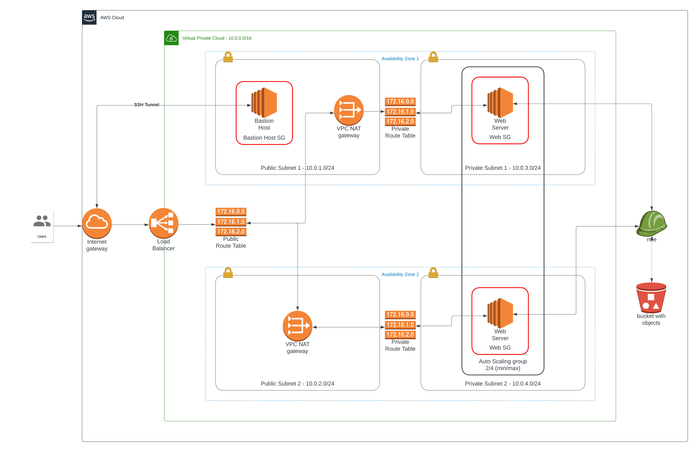

# Udacity DevOps NanoDegree Project 2 - High availability web app for Udagram

## Submission Details

[URL to Site][def]

This system diagram is very similar to the diagram that we developed as we went along in the lectures.  The main differences are:

1. Bastion Host - I added a bastion host to my `service-layer` Cloudformation template.
1. S3 Bucket - I added object to my S3 bucket to make the deployment of my services more streamlined.
1. IAM Assume Role - To secure the S3 objects I created an IAM Assume Role to my EC2 instances (Web Servers and Bastion) to ensure they are locked down.
1. JSON not YAML - I wanted to challange myself and decided early on that I would compose my Cloudformation Templates in JSON.  This added a bit of a challange at first but one I found the `Fn::...` in the documentation I was able to successfully complete the templates in this format.
1. Website - I repurposed the website that we utilized earlier in the course.

## Scenario

Your company is creating an Instagram clone called Udagram.

Developers want to deploy a new application to the AWS infrastructure.

You have been tasked with provisioning the required infrastructure and deploying a dummy application, along with the necessary supporting software.

This needs to be automated so that the infrastructure can be discarded as soon as the testing team finishes their tests and gathers their results.

Optional - To add more challenge to the project, once the project is completed, you can try deploying sample website files located in a public S3 Bucket to the Apache Web Server running on an EC2 instance. Though, it is not the part of the project rubric.

## Project Requirements

### Server specs

You'll need to create a Launch Configuration for your application servers in order to deploy four servers, two located in each of your private subnets. The launch configuration will be used by an auto-scaling group.

You'll need two vCPUs and at least 4GB of RAM. The Operating System to be used is Ubuntu 18. So, choose an Instance size and Machine Image (AMI) that best fits this spec.

Be sure to allocate at least 10GB of disk space so that you don't run into issues.

Security Groups and Roles

Since you will be downloading the application archive from an S3 Bucket, you'll need to create an IAM Role that allows your instances to use the S3 Service.

Udagram communicates on the default HTTP Port: 80, so your servers will need this inbound port open since you will use it with the Load Balancer and the Load Balancer Health Check. As for outbound, the servers will need unrestricted internet access to be able to download and update their software.

The load balancer should allow all public traffic (0.0.0.0/0) on port 80 inbound, which is the default HTTP port. Outbound, it will only be using port 80 to reach the internal servers.

The application needs to be deployed into private subnets with a Load Balancer located in a public subnet.

One of the output exports of the CloudFormation script should be the public URL of the LoadBalancer. Bonus points if you add http:// in front of the load balancer DNS Name in the output, for convenience.

-----

[def]: http://servi-webap-71m8eo9uw6sb-1902865430.us-west-2.elb.amazonaws.com/
